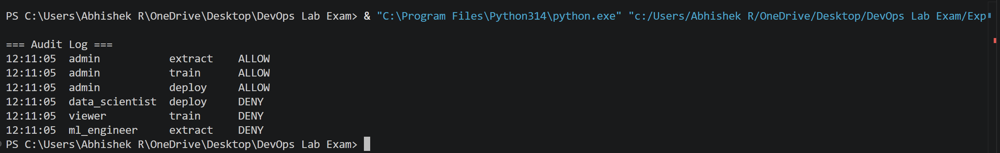
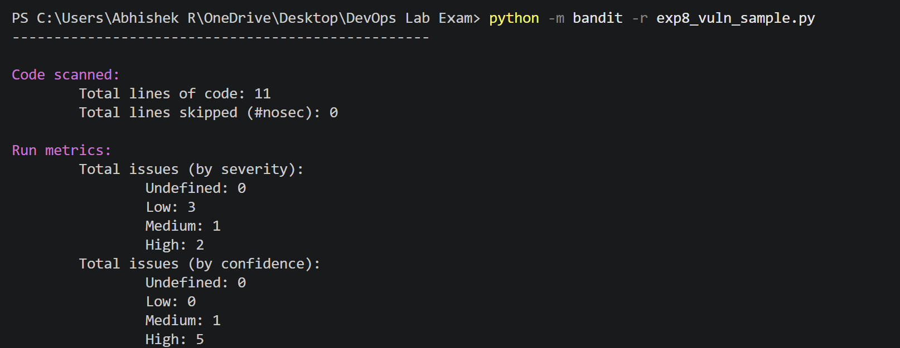
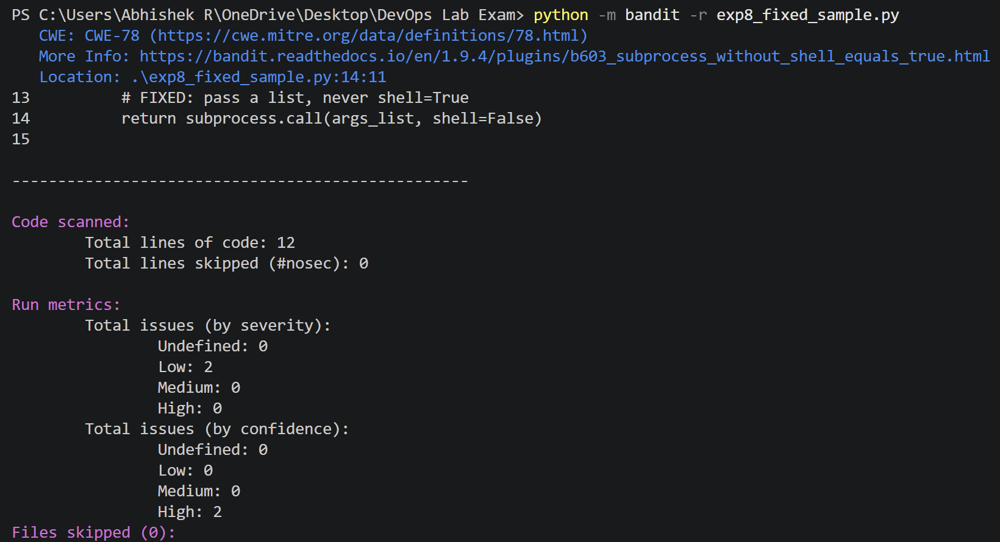

# DevSecMLOps Lab Exam

**Name:** Abhishek Reddy  
**Roll No:** 23WU0101133
**Section:** CSE Rhinos Core
**Course:** DevSecMLOps Lab, B.Tech CSE (2023–2027), Woxsen University  
**Experiments:** Exp 6 (ML Pipeline with Access Control) and Exp 8 (Vulnerability Scanning in the ML Pipeline)

---

## Repository Structure

```
devsecmlops-labexam/
├── Exp6.py                  # Exp 6: RBAC for ML pipeline stages
├── exp8_vuln_sample.py      # Exp 8: ML utility with deliberate vulnerabilities
├── exp8_fixed_sample.py     # Exp 8: same utility after remediation
├── screenshots/             # Execution outputs
└── README.md
```

---

## Experiment 6: ML Pipeline with Access Control (RBAC)

### Aim
To enforce Role-Based Access Control on ML pipeline stages using a permission-checking decorator and an audit log, so each role performs only authorised actions and every decision is recorded.

### Roles and Permissions

| Role | Allowed permissions |
| --- | --- |
| data_engineer | extract, transform |
| data_scientist | transform, train, evaluate |
| ml_engineer | train, evaluate, deploy |
| admin | extract, transform, train, evaluate, deploy |
| viewer | view |

### How it works
1. `ROLES` maps each role to its allowed permissions (least privilege).
2. The `require(permission)` decorator checks the caller's role before a stage runs.
3. Every decision (ALLOW / DENY) is written to `AUDIT_LOG` with a timestamp.
4. Unauthorised calls raise `AccessDenied` and the stage is blocked.

### Run
```bash
python Exp6.py
```

### Output


```
=== ML Pipeline Access Control ===
[AUTH OK ] admin           -> extract
[AUTH OK ] admin           -> train
[AUTH OK ] admin           -> deploy
[DENIED  ] Role 'data_scientist' is NOT authorized for 'deploy'
[DENIED  ] Role 'viewer' is NOT authorized for 'train'
[DENIED  ] Role 'ml_engineer' is NOT authorized for 'extract'

=== Audit Log ===
10:22:41  admin           extract    ALLOW
10:22:41  admin           train      ALLOW
10:22:41  admin           deploy     ALLOW
10:22:41  data_scientist  deploy     DENY
10:22:41  viewer          train      DENY
10:22:41  ml_engineer     extract    DENY
```

### DevSecMLOps Phases
| Phase | Implementation |
| --- | --- |
| Plan & Design | Threats: privilege escalation, tampering, repudiation. Least-privilege role design. |
| Develop & Build | Decorator separates security from pipeline logic; deny-by-default for unknown roles; no secrets in code. |
| Test & Verify | 6 test cases: 3 ALLOW for admin, 3 DENY for unauthorised roles. All passed. |
| Deploy & Monitor | Only ml_engineer/admin can deploy; audit log supports monitoring and incident response. |

---

## Experiment 8: Vulnerability Scanning in the ML Pipeline

### Aim
To detect security vulnerabilities in ML pipeline code using the Bandit SAST tool, remediate them, and verify the fixes with a re-scan.

### Vulnerabilities and Fixes

| Bandit ID | Issue | Severity | CWE | Fix |
| --- | --- | --- | --- | --- |
| B301 | `pickle.load` on untrusted data | Medium | CWE-502 | `json.load` |
| B602 | `subprocess` with `shell=True` | High | CWE-78 | List args, `shell=False` |
| B324 | MD5 hash | High | CWE-327 | SHA-256 |
| B105 | Hardcoded password | Low | CWE-259 | `os.environ.get("DB_PASSWORD")` |

### Run
```bash
pip install bandit
python -m bandit -r exp8_vuln_sample.py
python -m bandit -r exp8_fixed_sample.py
```

### Output: Vulnerable Code Scan


### Output: Fixed Code Scan


### Result

| Severity | Before fix | After fix |
| --- | --- | --- |
| High | 2 | 0 |
| Medium | 1 | 0 |
| Low | 3 | 2 |

All High and Medium vulnerabilities were eliminated. The 2 remaining Low findings (B404, B603) only flag use of the `subprocess` module and are informational.

### DevSecMLOps Phases
| Phase | Implementation |
| --- | --- |
| Plan & Design | Threats mapped to CWEs: code execution, command injection, weak crypto, credential leak. |
| Develop & Build | SAST with Bandit; secure coding fixes; secrets moved to environment variables. |
| Test & Verify | Re-scan confirms High 2 → 0, Medium 1 → 0. Bandit can run as a CI/CD gate. |
| Deploy & Monitor | Only code passing the scan is deployed; scans run on every push. |

---

## Tools Used
Python 3.14 · Bandit 1.9.4 · Git · GitHub · VS Code
